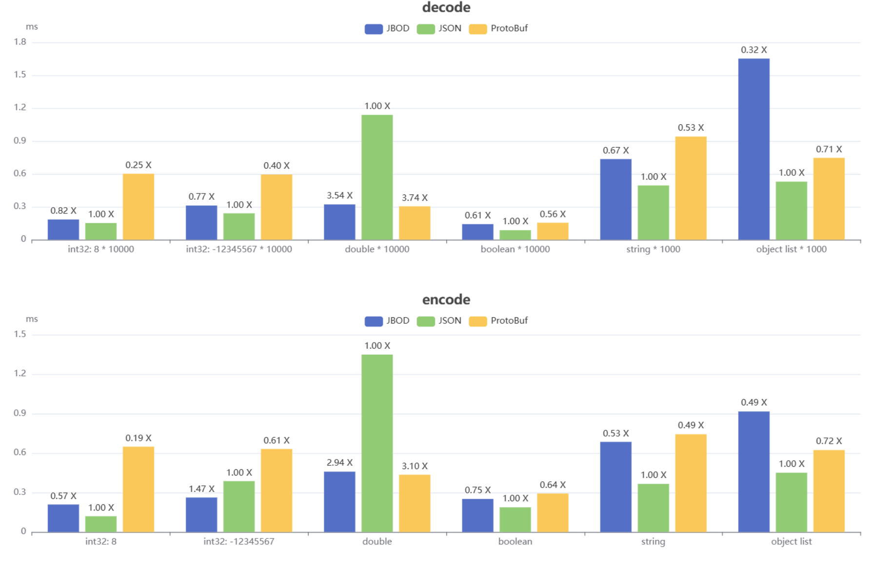
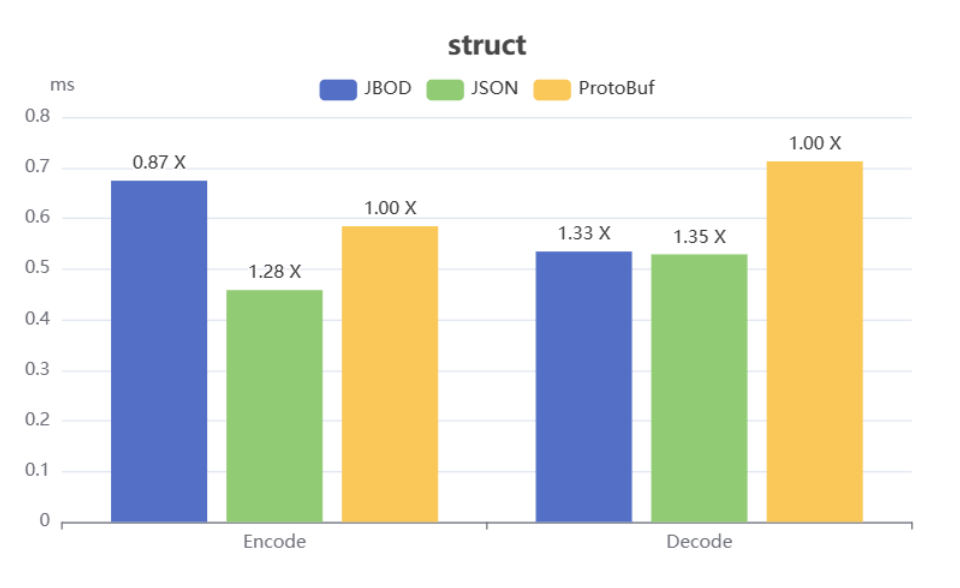

[![ESM-only package][package]][package-url]
[![NPM version][npm]][npm-url]
[![Install size][size]][size-url]
[![Build status][build]][build-url]

[package]: https://img.shields.io/badge/package-ESM--only-ffe536.svg
[package-url]: https://nodejs.org/api/esm.html
[npm]: https://img.shields.io/npm/v/jbod.svg
[npm-url]: https://npmjs.com/package/jbod
[size]: https://packagephobia.com/badge?p=jbod
[size-url]: https://packagephobia.com/result?p=jbod
[build]: https://github.com/asnowc/jbod/actions/workflows/ci.yaml/badge.svg?branch=main
[build-url]: https://github.com/asnowc/jbod/actions

## JavaScript Binary Object Data

JavaScript 二进制序列化与反序列库。支持更多的 JS 数据类型，序列化后大小占用很小。可用于传输、和存储。\
JavaScript Binary Serialization and deserialization lib. Support for more JS data types。Can be used for transmission, and storage. \
借鉴了 BSON 和 ProtoBuf, 不过设计 JBOD 的主要用于传输 JavaScript 数据。 [查看 JBOD 编码格式](./docs/jbod.md)

### 功能特性

##### 更多的 JavaScript 数据类型

| 类型       | 备注                                       |
| ---------- | ------------------------------------------ |
| boolean    |                                            |
| null       |                                            |
| undefined  |                                            |
| number     | 支持 NaN、-Infinity、+Infinity             |
| bigint     |                                            |
| Uint8Array |                                            |
| string     |                                            |
| RegExp     |                                            |
| Array      |                                            |
| Object     |                                            |
| Symbol     | 意义不大, 转换后只保留 description 属性    |
| Error      | 仅支持保留 cause、code、message、name 属性 |
| Map        |                                            |
| Set        |                                            |

##### 更小的二进制数据大小

| 数据类型                              | 字节大小(JSON)    | 字节大小(JBOD) |
| ------------------------------------- | ----------------- | -------------- |
| int(0~2147483647)                     | 1~ 10             | 1~5            |
| int (-1~-2147483648)                  | 2~ 11             | 1~5            |
| double                                | 1~22              | 8              |
| boolean                               | 4(true)、5(false) | 1              |
| null                                  | 4                 | 1              |
| string (设 n 为字符串 utf-8 编码长度) | n+2               | n+(1~5)        |

**实际测试**

```ts
import JBOD, { StructTrans } from "jbod";
import { Buffer } from "node:buffer";
function encodeJSON(data: any) {
  return Buffer.from(JSON.stringify(data));
}
export const objData = {
  disabled: false,
  count: 100837,
  name: "Documentation",
  dataStamp: 4 / 7,
  id: 876,
};

const anyStruct = StructTrans.define({ disabled: 1, count: 2, name: 3, dataStamp: 4, id: 5 });
const fixedStruct = StructTrans.define({
  disabled: { id: 1, type: "bool" },
  count: { id: 2, type: "dyI32" },
  name: { id: 3, type: "string" },
  dataStamp: { id: 4, type: "f64" },
  id: { id: 5, type: "dyI32" },
});

console.log(encodeJSON(objData).byteLength); // 96
console.log(JBOD.encode(objData).byteLength); // 67   (70% of JSON)
console.log(anyStruct.encode(objData).byteLength); // 38 (55% of JSON)
console.log(fixedStruct.encode(objData).byteLength); // 34 (35% of JSON)
```

### 使用

#### node

`npm install jbod`

```js
import JBOD from "jbod";

const data = [1, "string", new Set([7, 2, 4]), new Uint8Array([1, 2, 3]), 12n];

const u8Arr = JBOD.encode(data);
const data2 = JBOD.decode(u8Arr).data;
```

#### deno 或浏览器

```ts
import JBOD from "https://esm.sh/jbod";
const data = [1, "string", new Set([7, 2, 4]), new Uint8Array([1, 2, 3]), 12n];

const u8Arr = JBOD.encode(data);
const data2 = JBOD.decode(u8Arr).data;
```

#### StructTrans 定义

假设当前需要定义如下数据结构：

```ts
interface Data {
  name: string;
  count: number;
  custom: any;
}
```

对应的 Struct:

```ts
const struct = StructTrans.define({
  name: { id: 1, type: "string" },
  count: { id: 2, type: "dyInt" },
  custom: { id: 111, type: "any" },
});
const rawData = { name: "test", count: 9, custom: [1] };
const u8Arr = struct.encode(rawData);

const data = struct.decode(u8Arr).data;
console.log(data);
```

需要注意的是，id 用于与键名进行映射，它必须是正整数，并且不能重复。
对于 any 类型，可以省略类型的编写，本例子中 custom 字段可以这样定义：

```ts
const struct = StructTrans.define({
  name: { id: 1, type: "string" },
  count: { id: 2, type: "dyInt" },
  custom: 111,
});
```

### API

```ts
type UserCalcResult = { byteLength: number; type: number; pretreatment: unknown };
declare const JBOD: {
  /**
   * 从 Uint8Array 解析数据
   * @param type - 指定解析的数据类型. 对于 createWriter() 编码的数据，不应指定。 
   * 对于 encodeContentWriter() 编码的数据，需要指定才能正确解析。
   */
  decode(buffer: Uint8Array, offset?: number, type?: number): DecodeResult;
  /** 创建 DataWriter 用于编码, 这个方法创建的 DataWriter 会比 encodeContentWriter 多一个字节 */
  createWriter(data: any): DataWriter;
  /** 创建 DataWriter 用于编码 将数据编码为不携带类型的 Uint8Array, 这会比 encodeInto 少一个字节  */
  encodeContentWriter(data: any): DataWriter;
  /** 获取数据对应的类型 ID */
  toTypeCode(data: any): number;
  /** 将数据直接编码为二进制数据 */
  encode(data: any): Uint8Array;
};
export type { JBOD as default };

export interface DataWriter {
  encodeTo(buf: Uint8Array, offset: number): number;
  readonly byteLength: number;
}
```

#### StructTrans 数据类型

| 可用类型  | 描述                              | js 类型    |
| --------- | --------------------------------- | ---------- |
| dyI32     | zigzag+ varints 编码              | number     |
| dyI64     | zigzag+ varints 编码              | bigint     |
| i32       | 32 位整型                         | number     |
| i64       | 64 位整型                         | bigint     |
| f64       | 64 为浮点                         | number     |
| bool      | 布尔类型                          | boolean    |
|           |                                   |            |
| string    | 字符串                            | string     |
| binary    | 二进制数据                        | Uint8Array |
| any       | 任意类型                          |            |
| anyArray  | 任意数组(数组元素可以是任意类型)  |            |
| anyRecord | 任意对象 (对象字段可以是任意类型) |            |
|           |                                   |            |
| regExp    |                                   | RegExp     |
| error     |                                   | Error      |
| map       |                                   | Map        |
| set       |                                   | Set        |
| symbol    |                                   | symbol     |

### 基准测试

通过与 JSON、ProtoBuf 对不同数据类型的编解码的耗时进行了对比。为了获得更精准的结果，使用了 Deno 进行基准测试。
对于 JSON 的编码，是先将数据编码成字符串，再将字符串编码为 utf8 二进制数据。解码则是将二进制数据通过 utf-8 解码，然后解析字符串 JSON
对于 ProtoBuf，由于它不支持直接定义数组类型，在测试中定义了一个只有一个字段的对象，这个对象的类型为 repeat 类型。也就是说，在下面的测试中，JSON 和 JBOD 处理的如果是 10000 个 8 的数组，那么 ProtoBuf 处理的则是 1 个带有 10000 个 8 的数组的对象。

#### 不同数据类型的编解码对比


上图的基准测试中，是对一个数组进行编解码，其中数组的值是相同的，每组测试的数据如下

| 名称                   | 数据                         |
| ---------------------- | ---------------------------- |
| int32: 8\*10000        | 10000 个值为 8 的数组        |
| int32: -1234567\*10000 | 10000 个值为 -1234567 的数组 |
| double \*10000         | 10000 个值为 4 / 7 的数组    |
| boolean \*10000        | 10000 个值为 true 的数组     |
| string \*1000          | 1000 个值为 "中文 abc"的数组 |

object list \*1000 ：

```
{
  disabled: false,
  count: 100837,
  name: "Documentation",
  dataStamp: 4 / 7,
  id: 876,
}
```

**结论：**
对于整数类型，可以看到影响 JSON 编解码的的时间是字符串长度，在对浮点数据处理是尤其耗时。

为什么 JBOD 处理对象怎么慢？
JBOD 在处理对象时，80% 的耗时主要在处理对象的键(字符串)，再者就是 JSON.stringify() 和 JSON.parse() 拥有 V8 底层的支持，JBOD 仅仅是通过 JavaScript 提供的 API 对 Object 进行遍历，然后编码。
那为什么 ProtoBuf 对对象类型编码与 JSON 差不多？
ProtoBuf 的键通过 id 进行了映射，键的编解码实际是对 varints 进行编解码，并且 ProtoBuf 的对象是预先定义好的，是固定的数据类型，具体可以往下看 Struct 编解码

#### Struct 编解码对比


上图是仍然是对1000长度的数组进行编解码，数组的值全为相同的对象
可以看到，对于相同的数据，Struct对比JBOD有了很大的提升
